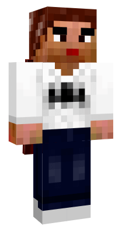
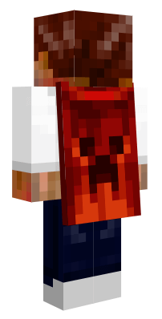

# Minecraft 3D and 2D Skin Viewer in pure CSS
## Introduction
This project started as a hands on experiment with CSS3 3D transforms to try to recreate 3D objects in pure CSS. The simplicity of the Minecraft character plus the fact that all the skin viewers I could find back when I started were all made with JavaScript and Canvas or Adobe Flash, which made this project the perfect candidate for such experiment.

The main idea here is to take JavaScript out of the equation, and leverage all rendering to the HTML engine of the browser.

The project features a 3D player viewer with or without cape, a 3D cape viewer and a 2D face viewer. You can use the example folder to see how to compile the required LessCSS files and how to use them.

The viewer is basically controlled with CSS classes. The viewers are designed to support different zoom factors. (More info on this, look inside the minecraft-skinviewer.less example). Special effects like rotation or waving are found in the mc-viewer-effects.less file.

This library supports both Modern and Legacy Skin and Cape formats.

## Known limitations
Browser compatibility may vary. Chrome and Firefox seems to support all the necessary features. At the nearest-neighbor image filtering setting, and therefore the skin texture will be blurry.

## License
This project is MIT licensed. The author is Robert Koszewski. More information can be found in the LICENSE file.

## 3D Skin Viewer
### 3D Viewer: Introduction
The 3D Player viewer is made in pure HTML and CSS and therefore requires the use of both. First the HTML elements are required for positioning of the faces. This HTML can be copied from the following examples. The viewer gets initialized with the "mc-skin-viewer-*x" class where the "*" is the choosen zoom level like for example mc-skin-viewer-11x. Then effects like "spin" or "wave" can be added to have the player to be spinning or waving. The position of the player can also be modified by using "transform:rotate*" on the element that has the "mc-skin-viewer-*x" class.

### Modern and Legacy skin support
Both Modern and Legacy skins are supported, but you need to specify when a legacy skin is in use and when not. By default the modern skin format is used. In order to use the legacy format you need to add the "legacy" class for the skin, or "legacy-cape" class for the cape to activate each type.

### 3D Player Viewer
3D Player Viewer (Without Cape)


```html
<!-- Set Skin for the Viewer -->
<style>
	#skin-viewer *{ background-image: url('skin_modern.png'); }
</style>

<!-- Skin Viewer HTML Elements -->
<div id="skin-viewer" class="mc-skin-viewer-11x spin">
	<div class="player">
		<!-- Head -->
		<div class="head" >
			<div class="top"></div>
			<div class="left"></div>
			<div class="front"></div>
			<div class="right"></div>
			<div class="back"></div>
			<div class="bottom"></div>
			<div class="accessory">
				<div class="top"></div>
				<div class="left"></div>
				<div class="front"></div>
				<div class="right"></div>
				<div class="back"></div>
				<div class="bottom"></div>
			</div>
		</div>
		<!-- Body -->
		<div class="body">
			<div class="top"></div>
			<div class="left"></div>
			<div class="front"></div>
			<div class="right"></div>
			<div class="back"></div>
			<div class="bottom"></div>
			<div class="accessory">
				<div class="top"></div>
				<div class="left"></div>
				<div class="front"></div>
				<div class="right"></div>
				<div class="back"></div>
				<div class="bottom"></div>
			</div>
		</div>
		<!-- Left Arm -->
		<div class="left-arm">
			<div class="top"></div>
			<div class="left"></div>
			<div class="front"></div>
			<div class="right"></div>
			<div class="back"></div>
			<div class="bottom"></div>
			<div class="accessory">
				<div class="top"></div>
				<div class="left"></div>
				<div class="front"></div>
				<div class="right"></div>
				<div class="back"></div>
				<div class="bottom"></div>
			</div>
		</div>
		<!-- Right Arm -->
		<div class="right-arm">
			<div class="top"></div>
			<div class="left"></div>
			<div class="front"></div>
			<div class="right"></div>
			<div class="back"></div>
			<div class="bottom"></div>
			<div class="accessory">
				<div class="top"></div>
				<div class="left"></div>
				<div class="front"></div>
				<div class="right"></div>
				<div class="back"></div>
				<div class="bottom"></div>
			</div>
		</div>
		<!-- Left Leg -->
		<div class="left-leg">
			<div class="top"></div>
			<div class="left"></div>
			<div class="front"></div>
			<div class="right"></div>
			<div class="back"></div>
			<div class="bottom"></div>
			<div class="accessory">
				<div class="top"></div>
				<div class="left"></div>
				<div class="front"></div>
				<div class="right"></div>
				<div class="back"></div>
				<div class="bottom"></div>
			</div>
		</div>
		<!-- Right Leg -->
		<div class="right-leg">
			<div class="top"></div>
			<div class="left"></div>
			<div class="front"></div>
			<div class="right"></div>
			<div class="back"></div>
			<div class="bottom"></div>
			<div class="accessory">
				<div class="top"></div>
				<div class="left"></div>
				<div class="front"></div>
				<div class="right"></div>
				<div class="back"></div>
				<div class="bottom"></div>
			</div>
		</div>
	</div>
</div>
```		
### 3D Cape Viewer


```html
<!-- Set Skin for the Viewer -->
<style>
	#cape_viewer *{
		background-image: url('cape_legacy.png');
	}
</style>

<!-- Cape Viewer -->
<div id="cape_viewer" class="mc-cape-viewer-9x spin wave legacy">
	<div class="wrapper">
		<div class="cape">
			<div class="left"></div>
			<div class="front"></div>
			<div class="right"></div>
			<div class="back"></div>
		</div>
	</div>
</div>
```

### 3D Player + Cape Viewer
3D Player Viewer with 3D Cape

 

```html
<!-- Set Skin for the Viewer -->
<style>
	#skin-viewer *{ background-image: url('skin_legacy.png'); }
	#skin-viewer .cape{ background-image: url('cape_legacy.png'); }
</style>

<!-- Skin Viewer HTML Elements -->
<div id="skin-viewer" class="mc-skin-viewer-11x legacy legacy-cape spin">
	<div class="player">
		<!-- Head -->
		<div class="head" >
			<div class="top"></div>
			<div class="left"></div>
			<div class="front"></div>
			<div class="right"></div>
			<div class="back"></div>
			<div class="bottom"></div>
			<div class="accessory">
				<div class="top"></div>
				<div class="left"></div>
				<div class="front"></div>
				<div class="right"></div>
				<div class="back"></div>
				<div class="bottom"></div>
			</div>
		</div>
		<!-- Body -->
		<div class="body">
			<div class="top"></div>
			<div class="left"></div>
			<div class="front"></div>
			<div class="right"></div>
			<div class="back"></div>
			<div class="bottom"></div>
			<div class="accessory">
				<div class="top"></div>
				<div class="left"></div>
				<div class="front"></div>
				<div class="right"></div>
				<div class="back"></div>
				<div class="bottom"></div>
			</div>
		</div>
		<!-- Left Arm -->
		<div class="left-arm">
			<div class="top"></div>
			<div class="left"></div>
			<div class="front"></div>
			<div class="right"></div>
			<div class="back"></div>
			<div class="bottom"></div>
			<div class="accessory">
				<div class="top"></div>
				<div class="left"></div>
				<div class="front"></div>
				<div class="right"></div>
				<div class="back"></div>
				<div class="bottom"></div>
			</div>
		</div>
		<!-- Right Arm -->
		<div class="right-arm">
			<div class="top"></div>
			<div class="left"></div>
			<div class="front"></div>
			<div class="right"></div>
			<div class="back"></div>
			<div class="bottom"></div>
			<div class="accessory">
				<div class="top"></div>
				<div class="left"></div>
				<div class="front"></div>
				<div class="right"></div>
				<div class="back"></div>
				<div class="bottom"></div>
			</div>
		</div>
		<!-- Left Leg -->
		<div class="left-leg">
			<div class="top"></div>
			<div class="left"></div>
			<div class="front"></div>
			<div class="right"></div>
			<div class="back"></div>
			<div class="bottom"></div>
			<div class="accessory">
				<div class="top"></div>
				<div class="left"></div>
				<div class="front"></div>
				<div class="right"></div>
				<div class="back"></div>
				<div class="bottom"></div>
			</div>
		</div>
		<!-- Right Leg -->
		<div class="right-leg">
			<div class="top"></div>
			<div class="left"></div>
			<div class="front"></div>
			<div class="right"></div>
			<div class="back"></div>
			<div class="bottom"></div>
			<div class="accessory">
				<div class="top"></div>
				<div class="left"></div>
				<div class="front"></div>
				<div class="right"></div>
				<div class="back"></div>
				<div class="bottom"></div>
			</div>
		</div>
		<!-- Cape -->
		<div class="cape">
			<div class="top"></div>
			<div class="left"></div>
			<div class="front"></div>
			<div class="right"></div>
			<div class="back"></div>
			<div class="bottom"></div>
		</div>
	</div>
</div>
```

### 2D Face Viewer
Allows to see the 2D representation of the face. Does not require to specify if the skin is legacy or not.


```html
<div class="mc-face-viewer-8x" style="background-image:url('skin_legacy.png')"></div>
```